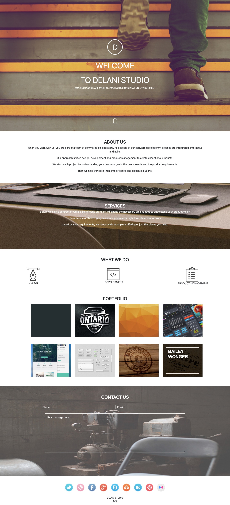

# Delani Studio site
## Ian charawe
## Description
delani studio project is a design website that aims in implementing design format and functions from javascript
## Deployment
https://github.com/Nyiva/Delanistudio
## Technology used
HTML
CSS
Bootstrap 4.3.1
Jquery 3.4.1
Javascript
## BDD

- project is about delani studio design and has one page
- About us explains the function of the website
- Services shows what services delani offers
- What we do is a section that allow users to toggle through the functions
- when it comes to the email the website is responsive and gives a feedback depending on the entry

## BUGS
it contains bugs in css and html
## Support and contact details
Iancharawe94@gmail.com
254 27 487 476
## License
MIT license